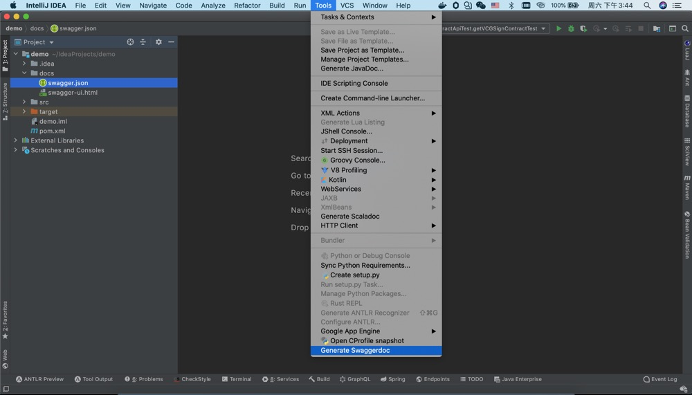
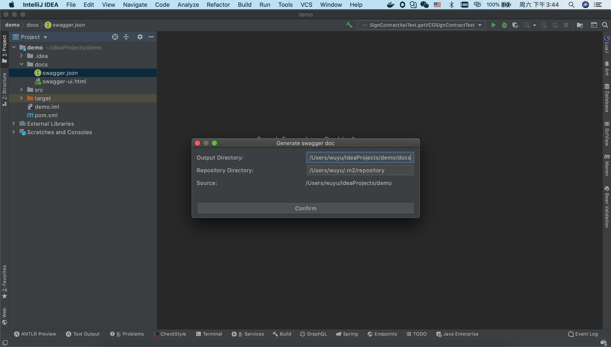
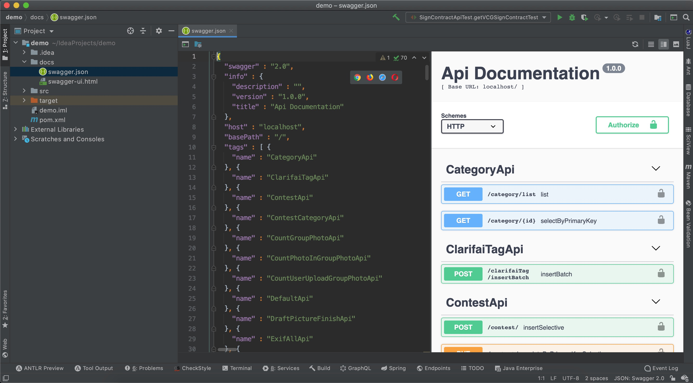
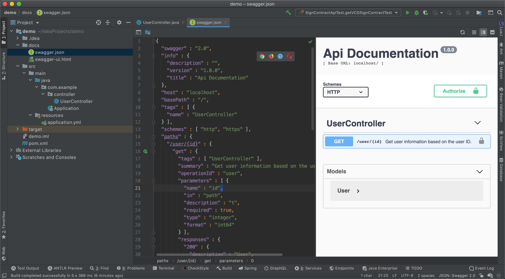
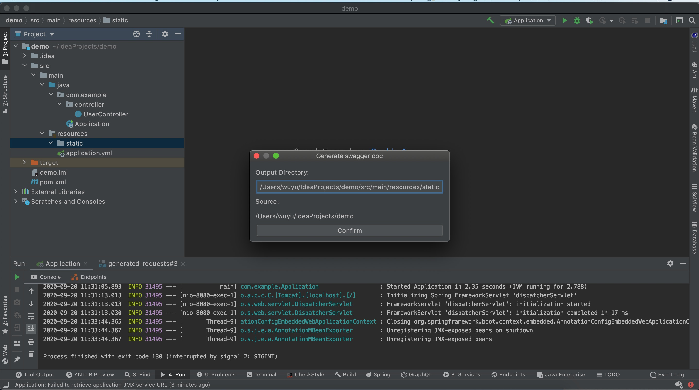
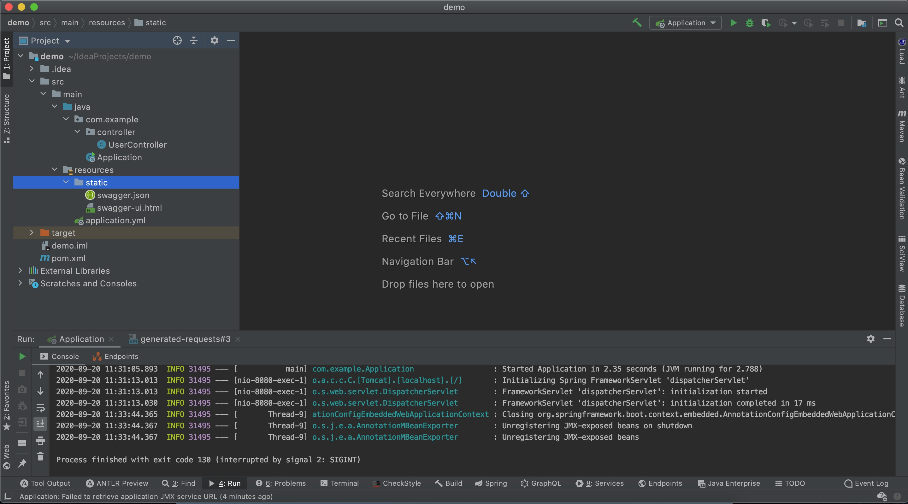
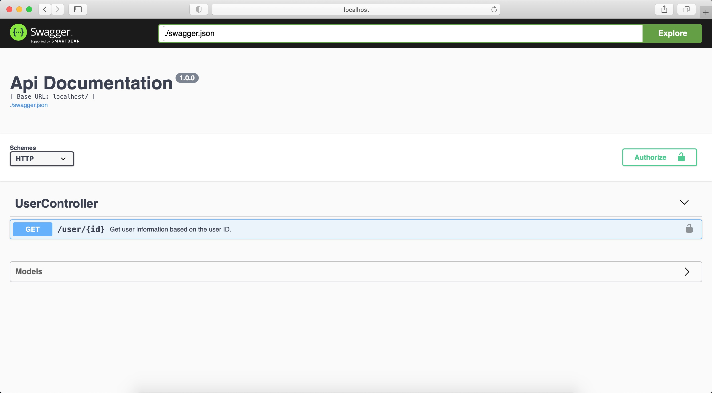

# springmvc2swagger

springmvc2swagger is a tool that can convert springMVC annotations and javadoc to Swagger documents


## Plugin insstall

[https://plugins.jetbrains.com/plugin/15095-springmvc2swagger](https://plugins.jetbrains.com/plugin/15095-springmvc2swagger)

## Demo

Java Sources

```
@RequestMapping("user")
@RestController
public class UserController {


    /**
     * Get user information based on the user ID.
     *
     * @param id t
     * @return User
     */
    @GetMapping("{id}")
    public User user(@PathVariable("id") Long id) {
        return new User();
    }


    @Data
    public static class User {

        /**
         * user id 
         */
        private Long id;

        /**
         * login name.
         */
        @NotNull
        private String username;

        /**
         * About this user.
         */
        private String about;

    }
}
```

Convert to SwaggerDoc
```
{
  "swagger" : "2.0",
  "info" : {
    "description" : "",
    "version" : "1.0.0",
    "title" : "Api Documentation"
  },
  "host" : "localhost",
  "basePath" : "/",
  "tags" : [ {
    "name" : "UserController"
  } ],
  "schemes" : [ "http", "https" ],
  "paths" : {
    "/user/{id}" : {
      "get" : {
        "tags" : [ "UserController" ],
        "summary" : "Get user information based on the user ID.",
        "operationId" : "user",
        "parameters" : [ {
          "name" : "id",
          "in" : "path",
          "description" : "t",
          "required" : true,
          "type" : "integer",
          "format" : "int64"
        } ],
        "responses" : {
          "200" : {
            "description" : "User",
            "schema" : {
              "$ref" : "#/definitions/User"
            }
          }
        },
        "security" : [ {
          "api_key" : [ ]
        } ]
      }
    }
  },
  "securityDefinitions" : {
    "api_key" : {
      "type" : "apiKey",
      "name" : "Authorization",
      "in" : "header"
    }
  },
  "definitions" : {
    "User" : {
      "required" : [ "username" ],
      "properties" : {
        "about" : {
          "type" : "string",
          "description" : "About this user."
        },
        "id" : {
          "type" : "integer",
          "format" : "int64",
          "description" : "user id"
        },
        "username" : {
          "type" : "string",
          "description" : "login name."
        }
      }
    }
  }
}
```








## springboot

You can generate the file to a static directory, and then launch the springboot service to access http://localhost:80





