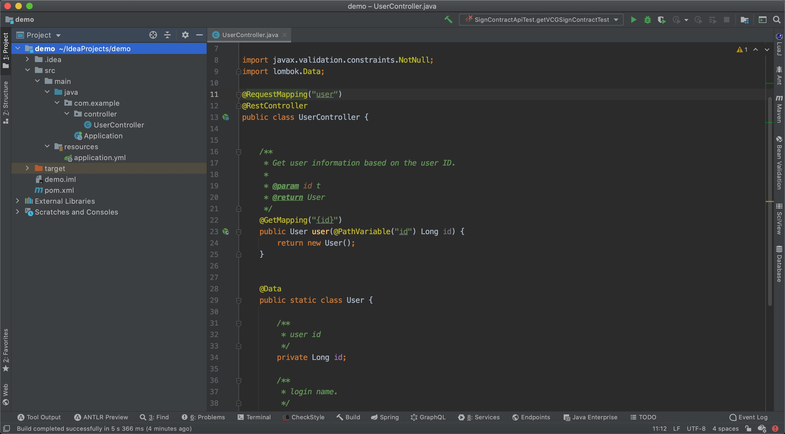
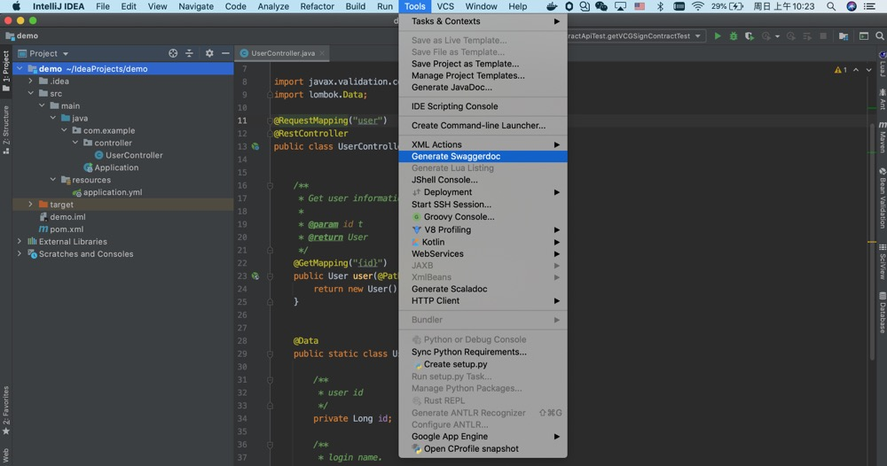
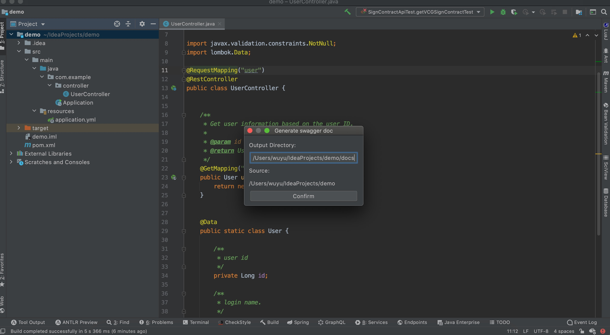

# springmvc2swagger

springmvc2swagger is a tool that can convert springMVC annotations to Swagger documents

## Plugin insstall

[https://plugins.jetbrains.com/plugin/15095-springmvc2swagger](https://plugins.jetbrains.com/plugin/15095-springmvc2swagger)

## Demo

